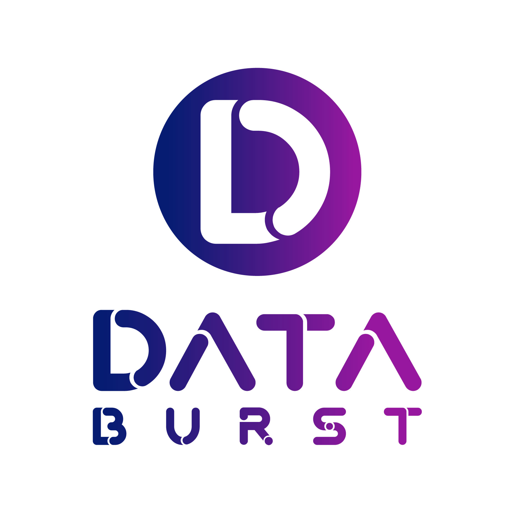
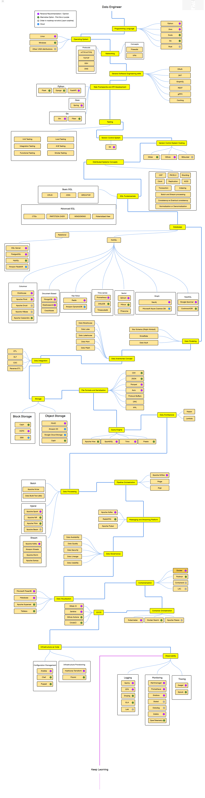

# DataBurst

    
    

We are a group of dedicated data engineers at DataBurst, are excited to share a comprehensive roadmap tailored for data engineering professionals at all levels—from those just starting out to the most seasoned experts.

Whether you're a junior engineer seeking direction or a senior professional aiming to stay ahead of the curve, this roadmap offers valuable guidance and industry best practices.

It's not an end; this roadmap is a living document. If you have suggestions, want to make changes, or add new insights, we welcome your contributions. Join our collaborative effort to refine and enhance this roadmap for the data engineering community.

----------------------

**Website**: [www.databurst.tech](https://www.databurst.tech)

**Discord**: [DataBurst Discord](https://discord.gg/DWVD3gVv)

## Table of Contents

- [DataBurst](#databurst)
  - [Table of Contents](#table-of-contents)
  - [Data Engineering Roadmap](#data-engineering-roadmap)
  - [Contributors (Alphabetical Order)](#contributors-alphabetical-order)
  - [Contributing](#contributing)
  - [License](#license)

## Data Engineering Roadmap

## Contributors (Alphabetical Order)

- [Alireza Shateri](https://www.linkedin.com/in/alireza-shateri-a91093176/)
- [Dorsa Hasanlee](https://www.linkedin.com/in/dorsa-hasanlee/)
- [Mostafa Ghadimi](https://www.linkedin.com/in/mostafaghadimi/)
- [Niyusha Baghayi](https://www.linkedin.com/in/niyusha-baghayi/)
- [Reza Amini Majd](https://www.linkedin.com/in/rezaaminimajd/)

## Contributing

We welcome contributions to our data engineering roadmap! If you'd like to get involved, here's how you can help:

- Fork the data-burst/data-engineering-roadmap repository
- Modify the `roadmap.yaml` file based on your suggestions and ideas for improving the roadmap
- Once you've made your changes, commit them and submit a pull request

For more details on our contribution guidelines, please check out the [CONTIRIBUTION.md](CONTRIBUTING.md) file in the repository. We're excited to collaborate with the community and make this roadmap even better. Looking forward to your contributions!

## License

This repository is licensed under the MIT License, which is a permissive open-source license that allows for reuse and modification of the code with few restrictions. You can find the full text of the license in [this](./LICENSE) file.
